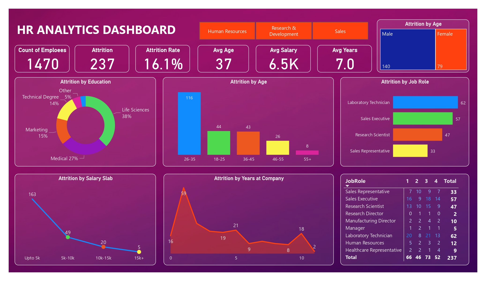

# InsightHR:Uncovering Workforce Attrition Trends

Welcome to **InsightHR**, a Power BI dashboard designed to analyze and visualize workforce attrition trends. This project presents a clear and structured view of employee turnover, highlighting patterns that support informed HR strategies.

## 📈 Project Overview

Employee attrition can impact organizational performance and morale. This dashboard was developed to translate complex HR data into actionable insights. By visualizing patterns across employee age, tenure, salary, education field, and job role, the dashboard provides a comprehensive view of key factors influencing attrition. The focus is on making data-driven insights accessible and meaningful to both technical teams and business decision-makers.

## 📚 Data Structure & Cleaning Overview

The dataset includes records for around **1,500 employees**, with the following attributes:

| Column Name              | Data Type | Description |
|---------------------------|-----------|-------------|
| EmpID                     | object    | Unique identifier |
| Age                       | int64     | Age of employee |
| AgeGroup                  | object    | Categorized age group |
| Attrition                 | object    | Attrition status (Yes/No) |
| BusinessTravel            | object    | Frequency of business travel |
| DailyRate                 | int64     | Daily pay rate |
| Department                | object    | Department name |
| DistanceFromHome          | int64     | Distance from home to workplace |
| Education                 | int64     | Education level |
| EducationField            | object    | Field of education |
| EmployeeCount             | int64     | Employee count (likely always 1) |
| EmployeeNumber            | int64     | Employee number (internal) |
| EnvironmentSatisfaction   | int64     | Satisfaction with work environment |
| Gender                    | object    | Gender of employee |
| HourlyRate                | int64     | Hourly pay rate |
| JobInvolvement            | int64     | Level of job involvement |
| JobLevel                  | int64     | Job level within the organization |
| JobRole                   | object    | Job title |
| JobSatisfaction           | int64     | Satisfaction with job |
| MaritalStatus             | object    | Marital status |
| MonthlyIncome             | int64     | Monthly income |
| SalarySlab                | object    | Categorized salary range |
| MonthlyRate               | int64     | Monthly pay rate |
| NumCompaniesWorked        | int64     | Number of companies previously worked for |
| Over18                    | object    | Over 18 indicator |
| OverTime                  | object    | Works overtime (Yes/No) |
| PercentSalaryHike         | int64     | Percentage salary hike |
| PerformanceRating         | int64     | Performance rating |
| RelationshipSatisfaction  | int64     | Satisfaction with relationships at work |
| StandardHours             | int64     | Standard working hours |
| StockOptionLevel          | int64     | Level of stock options granted |
| TotalWorkingYears         | int64     | Total working years |
| TrainingTimesLastYear     | int64     | Number of trainings attended last year |
| WorkLifeBalance           | int64     | Work-life balance satisfaction |
| YearsAtCompany            | int64     | Years with company |
| YearsInCurrentRole        | int64     | Years in current role |
| YearsSinceLastPromotion   | int64     | Years since last promotion |
| YearsWithCurrManager      | int64     | Years with current manager |

### 🧹 Data Cleaning & Transformation Steps:
- Removed duplicate records and handled missing values to ensure data integrity.
- Standardized categorical fields (e.g., job roles, education fields) for consistency.
- Created calculated columns such as **SalarySlab** to simplify analysis.
- Joined additional tables to enrich the dataset with department and tenure information.
- Applied transformations (e.g., date formats, string trimming) for cleaner visuals.
- Created relationships between tables to ensure correct filtering and aggregation.

These steps ensured the data was clean, reliable, and ready for meaningful visualization.

## 📸 Dashboard Preview

  
   <em>Figure 1: HR Analytics Dashboard Overview</em>

## 📅 Executive Summary

This dashboard uncovers important patterns in employee attrition:

🔹 **Age-Related Trends**  
Employees aged **26–35** show higher attrition rates, suggesting a focus area for engagement strategies.

🔹 **Early Tenure Impact**  
Attrition peaks within the first two years of employment, indicating potential opportunities to improve onboarding and early-stage support.

🔹 **Role-Specific Variations**  
Job roles such as Laboratory Technicians, Sales Executives, and Research Scientists display higher attrition levels, pointing to possible job-specific challenges.

🔹 **Education and Salary Factors**  
Higher attrition is observed among employees with **Life Sciences** and **Medical degrees**, particularly in lower salary slabs (≤ 5K), highlighting areas where adjustments in compensation and career development pathways might be beneficial.

By presenting these insights in an intuitive visual format, the dashboard enables decision-makers to understand and act on complex workforce trends.

## 🔍 Insights Deep Dive

### 🎯 Age and Role Analysis
- Employees in the **26–35 age group** represent the highest turnover segment.
- Roles such as **Lab Technicians** and **Sales Executives** have elevated attrition, which may reflect sector-specific challenges.

### 🎓 Education and Compensation
- Employees from **Life Sciences** and **Medical backgrounds** show higher attrition rates, suggesting a need for competitive compensation and clear career progression.
- Lower salary slabs are associated with higher turnover, underscoring the importance of equitable pay structures.

### 📉 Tenure Trends
- A significant proportion of attrition occurs within the first two years of employment, highlighting the need for early engagement and support strategies.

## 💡 Recommendations & Future Enhancements

This project offers valuable insights into workforce attrition, and future enhancements can expand its impact:

- Implement targeted engagement and support for younger employees and those in early tenure.
- Review and adjust compensation, especially for roles with high attrition rates.
- Provide clear career development paths in fields with high turnover, such as Life Sciences and Medical.
- Enhance onboarding processes to reduce early-stage attrition.
- Incorporate predictive modeling to proactively identify attrition risks.
- Integrate real-time data and expand metrics to include performance and engagement.

## 🚀 How to Use
1. **Clone this repository**.
2. Open `HR_Analytics_Dashboard.pbix` in **Power BI Desktop**.
3. Load the base dataset `HR_Analytics.csv` if required.
4. Perform the data cleaning steps according to your requirements.
5. Explore the dashboard and apply filters to examine trends across various dimensions.
